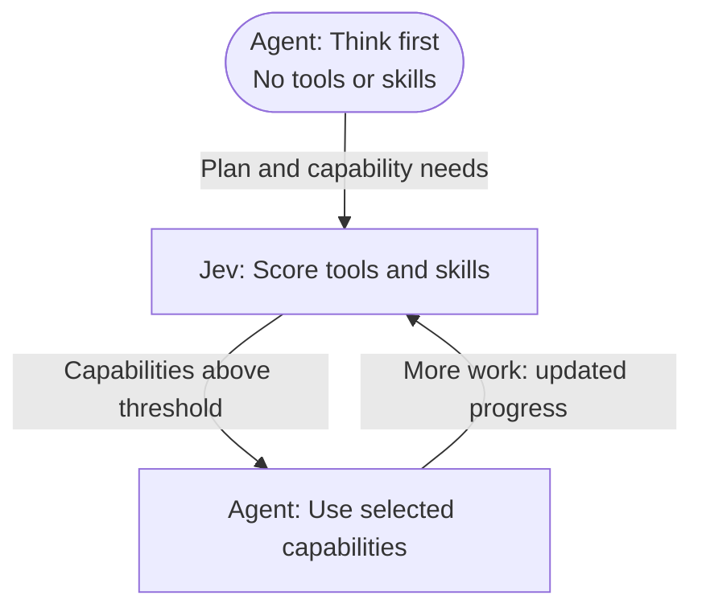

# Just enough tools

**Think first. Bring in tools and skills when they matter.**

[简体中文](README.zh-CN.md) · [How it works](#how-it-works) · [Install](#install-into-deepseek-harness) · [Contributing](CONTRIBUTING.md)

**Our goal: nearly half the agent cost, with accuracy intact.**

Just enough tools is a [DeepSeek Harness](https://github.com/deepseek-ai/deepseek-harness) plugin that uses [Jev](https://typesafe.ai/blog/introducing-system-one-models-and-jev) to reveal tools and skills progressively. The main model starts with a clean planning step. Jev then selects which capabilities to add as the task unfolds.

Agents often receive more tools and skills than a task needs. This creates two sources of waste:

- **Extra input cost:** schemas and descriptions for unused tools and skills occupy context and incur input-token costs on repeated model calls.
- **Overuse:** agents can invoke tools and skills unnecessarily, adding execution steps, latency and cost.

Just enough tools lets Jev select from a shared pool of tools and skills, exposing only the capabilities needed as the task progresses.

- **Tools and skills as equals.** One candidate pool, one threshold, one decision loop.
- **Room to adapt.** Add tools or skills as new requirements and results arrive.
- **Controlled exposure.** Selected tools become callable; selected skills contribute their full instructions.
- **Easy to inspect.** Each agent has an isolated capability set and a trace of scores, additions and usage.

## How it works



**Agent thinks → Jev selects tools and skills → Agent acts.** Each tool and skill is independently scored against the same threshold. A selected tool is registered; a selected skill's instructions are loaded into the Agent's context. Enabled capabilities stay available, and subsequent decisions consider only the remaining candidates.

Skills are not hidden behind another tool-selection step. They can be selected without any tool, or alongside tools in the same batch. A newly loaded workflow can reveal a need for additional capabilities, which Jev can select next.

### Example: fix a login bug

> “Fix the login error and run the tests.”

With a `login-debug` skill installed, one possible sequence is:

| Stage | Capabilities available to the Agent | What happens |
| --- | --- | --- |
| Plan | None | Agent plans to inspect the login code, fix it and verify the result |
| Investigate | Skill: `login-debug`; tools: `grep`, `read` | Agent follows the debugging workflow and locates the error |
| Fix | Skill: `login-debug`; tools: `grep`, `read`, **`edit`** | Jev selects `edit`; Agent applies the fix |
| Verify | Skill: `login-debug`; tools: `grep`, `read`, `edit`, **`bash`** | Jev selects `bash`; Agent runs the tests and reports the result |

For a rewriting task, Jev might select only a writing-style skill and no tools. If neither kind is needed, the Agent can answer directly.

## Install into DeepSeek Harness

Requires Node.js 22.19+ and DeepSeek Harness `0.1.7-alpha.1` / Cordis `4.0.3`. From the Just enough tools checkout, build the plugin bundle:

```sh
npm ci
npm pack
```

Install it into your dsh Web profile:

```sh
npx @deepseek-ai/dsh@0.1.7-alpha.1 plugin --profile web add /absolute/path/to/just-enough-tools/dsh-just-enough-tools-0.4.1.tgz
```

Restart your dsh Web process (`npx @deepseek-ai/dsh@0.1.7-alpha.1 web`), then:

1. Open **Plugins → dsh-just-enough-tools**.
2. Choose the **Provider API protocol**, enter its **Provider API key**, optionally override the URL and model, and click **Save**.
3. Start a new conversation and choose **Just enough tools** in the mode picker before sending the first message.

Just enough tools appears alongside the existing Standard, PTC, Minimal and Creator modes. It does not change the default mode or route ordinary-mode agents. If the mode picker is hidden, enable mode selection in dsh's General settings.

The mode comes with file, file-search and terminal tools, plus dsh skill discovery. Put skills under your project's `.dsh/skills` or `.agents/skills`, or the user skill directories configured in dsh. New skills are discovered as the task progresses. No catalog module or YAML edits are needed. The acting model remains the one configured in dsh — **Jev selects capabilities, the Agent does the work**.

### Add a skill

Create `.dsh/skills/login-debug/SKILL.md` in your project:

```markdown
---
name: login-debug
description: Diagnose login and session failures before changing authentication code.
---
Reproduce the failure, inspect the relevant code, make a focused fix, and run the affected tests.
```

Jev initially receives the skill's summary, not its full body. Selected instructions are injected automatically, preserving resource paths; there is no extra `skill` tool to unlock. Only model-invocable skills participate. Tools needed by a skill still pass their own threshold.

### Missing preset component at startup

If startup reports `Cannot find package '@deepseek-ai/dsh-agent-preset'`, check `dsh --version`. This plugin requires **0.1.7-alpha.1**; the 0.1.5 CLI does not include this component. Use the pinned version for both installation and startup. Updating the plugin does not upgrade dsh:

```sh
npx @deepseek-ai/dsh@0.1.7-alpha.1 web
```

### Vercel AI Gateway and custom providers

In **Plugins → dsh-just-enough-tools**, select **Vercel AI Gateway (Evaluation)** and enter your Gateway API key. Leave the URL and model blank to use these defaults:

| Setting | Vercel AI Gateway | System One / TypeSafe |
| --- | --- | --- |
| API base URL | `https://ai-gateway.vercel.sh/v4/ai` | `https://api.typesafe.ai/v1` |
| Jev model | `typesafe-ai/jev` | `jev-latest` |
| Key environment variable | `AI_GATEWAY_API_KEY` | `TYPESAFE_API_KEY` |

You can also set `JEV_API_KEY` for either protocol. A saved key takes priority, followed by `JEV_API_KEY`, then the matching provider variable. When switching providers, replace the saved key or reset it to use the environment variable; clear any old URL/model overrides to use the new defaults.

For another provider or a self-hosted proxy, choose its compatible protocol and enter its base URL, API key and Jev model ID. Full endpoints are also accepted. System One uses `/systemone` with Noul answers; Vercel uses `/evaluation-model` with boolean probabilities, matching the [AI SDK evaluation interface](https://vercel.com/docs/ai-gateway/sdks-and-apis/ai-sdk). An OpenAI-compatible chat endpoint alone does not supply this evaluation protocol.

### Settings

| Field | Default | Purpose |
| --- | --- | --- |
| Provider API protocol | `systemone` | System One or Vercel Evaluation; compatible custom endpoints supported |
| Provider API key | empty | Saved key, then `JEV_API_KEY`, then the matching provider environment variable |
| API base URL | blank: protocol default | Compatible provider base URL or full endpoint |
| Jev model | blank: protocol default | Provider-specific Jev model ID |
| Tool / skill threshold | `0.5` | The same strict probability threshold for both kinds |
| Steps per user turn | `12` | Maximum model decisions, including planning |
| Routing timeout | `60000` ms | Bound each discovery, scoring or skill-loading operation |

Settings are persisted through dsh. Saved keys are redacted from settings reads and never filled back into the page; leave the field blank to keep the saved key, or use **Reset saved key** to remove the profile override. Protocol, API key, URL and model changes apply to the next scoring call. Start a new conversation to use new routing limits.

To remove the mode:

```sh
dsh plugin --profile web remove dsh-just-enough-tools
```

See [plugin integration details](docs/integration.md) for capability ownership and mode lifecycle.

## Help shape the next version

We welcome new tools and skills, better threshold policies, and ways to avoid scoring when no new capability is needed. Share your use case, feedback, or a small reproducible example to help improve Just enough tools.

```sh
npm test
npm run typecheck
npm run build
```

Tests require no API keys. See [CONTRIBUTING.md](CONTRIBUTING.md). Just enough tools is an independent community project, licensed under [MIT](LICENSE).
