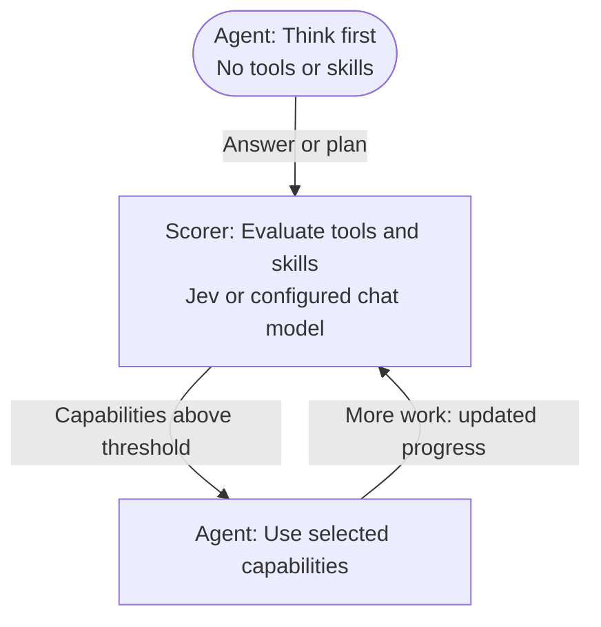

# Just enough tools

**Think first. Bring in tools and skills when they matter.**

[简体中文](README.zh-CN.md) · [Install](#install) · [Contributing](CONTRIBUTING.md)

**Our goal: nearly half the agent cost, with accuracy intact.**

Just enough tools is a [DeepSeek Harness](https://github.com/deepseek-ai/deepseek-harness) plugin for progressive tool and skill selection, powered by [Jev](https://typesafe.ai/blog/introducing-system-one-models-and-jev), with an optional OpenAI-compatible scorer.

Agents often receive more capabilities than a task needs:

- **Extra input cost:** unused tool and skill schemas and descriptions consume tokens on repeated requests.
- **Overuse:** unnecessary tool and skill invocations add steps, latency and cost.

The plugin puts tools and skills in one candidate pool and exposes only the capabilities selected for the task. Each agent has its own enabled set.

## How it works



Each capability receives an independent score. Tools **above** the shared threshold become callable; selected skills load their full instructions. Enabled capabilities remain available, while later decisions consider the remaining candidates. A skill's required tools are scored separately.

For simple tasks, the Agent can provide a complete first-response answer beginning with `No external capabilities needed.` If discovery is complete and all scores are **strictly below** the threshold, the plugin skips the second Agent call. Scoring still runs; failed scoring does not approve an early finish.

### Example

For “Fix the login error and run the tests,” the scorer can first enable the `login-debug` skill and `grep`/`read`, then add `edit` and `bash` as the task progresses. A writing task may need only a style skill, or no external capabilities at all.

## Install

Requires Node.js 22.19+, DeepSeek Harness **0.1.7-alpha.1**, and Cordis **4.0.3**.

Build from the repository:

```sh
npm ci
npm pack
```

Install the package and start dsh:

```sh
npx @deepseek-ai/dsh@0.1.7-alpha.1 plugin --profile web add /absolute/path/to/dsh-just-enough-tools-0.5.3.tgz
npx @deepseek-ai/dsh@0.1.7-alpha.1 web
```

1. Open **Plugins → dsh-just-enough-tools**.
2. Choose a provider protocol, configure credentials and model, and save.
3. Start a new conversation in **Just enough tools** mode.

The acting model remains the one configured in dsh. The mode includes file, search and terminal tools, and discovers model-invocable skills through dsh.

## Providers and settings

| Protocol | Default base URL | Model | Key environment variable |
| --- | --- | --- | --- |
| System One / TypeSafe | `https://api.typesafe.ai/v1` | `jev-latest` | `TYPESAFE_API_KEY` |
| Vercel AI Gateway (Evaluation) | `https://ai-gateway.vercel.sh/v4/ai` | `typesafe-ai/jev` | `AI_GATEWAY_API_KEY` |
| OpenAI-compatible / LM Studio | `http://127.0.0.1:1234/v1` | Required: provider model ID | `OPENAI_API_KEY` |

Custom compatible base URLs and full endpoints are supported. Credentials are resolved in this order: saved key → `JEV_API_KEY` → provider environment variable. Reset a saved key to use an environment variable. Unauthenticated local chat servers may leave the key blank. dsh reads `.env` at startup; restart it after changing that file.

System One and Vercel return native decision probabilities. OpenAI-compatible scoring requires a generative model that returns JSON scores; these are model estimates, not calibrated decision probabilities. Encoder-only models require a separate decision service. There is no automatic fallback between protocols.

| Setting | Default |
| --- | --- |
| Tool / skill threshold | `0.5` |
| Maximum steps per user turn | `12` |
| Routing operation timeout | `60000` ms |
| Terminal routing diagnostics | Enabled |

Provider settings and diagnostics apply immediately; start a new conversation after changing routing limits. Diagnostics show per-capability scores, threshold and admission results in the dsh terminal. Scoring or registration failures stop execution with an explicit error.

## Add a skill

Create `.dsh/skills/login-debug/SKILL.md` (or use dsh's other configured skill directories):

```markdown
---
name: login-debug
description: Diagnose login and session failures before changing authentication code.
---
Reproduce the failure, inspect the relevant code, make a focused fix, and run the affected tests.
```

The scorer initially sees the summary; the Agent receives full instructions only after selection. Capability selection controls availability and instruction injection, not filesystem permissions.

## Contribute

Help improve capability selection, provider support, thresholds and examples. See [CONTRIBUTING.md](CONTRIBUTING.md), [design](DESIGN.md), and [integration details](docs/integration.md).

Independent community project · [MIT license](LICENSE).
