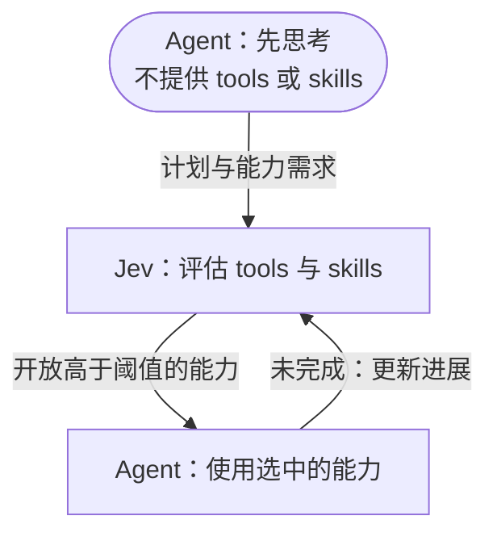

# Just enough tools

**先思考，需要时再给 tools 和 skills。**

[English](README.md) · [工作原理](#工作原理) · [安装使用](#安装到-deepseek-harness) · [参与贡献](CONTRIBUTING.md)

**目标：准确率不打折，Agent 费用近乎减半。**

Just enough tools 是一个 [DeepSeek Harness](https://github.com/deepseek-ai/deepseek-harness) 插件，用 [Jev](https://typesafe.ai/blog/introducing-system-one-models-and-jev) 按需、逐轮开放 tools 和 skills。执行模型先独立规划，再随着任务推进获得需要的能力。

Agent 往往会收到远超当前任务所需的 tools 和 skills，由此产生两类浪费：

- **额外输入成本**：用不到的 tools 和 skills 的 schema、描述占据上下文，并在反复请求模型时持续产生输入 token 费用。
- **过度调用**：Agent 可能不必要地调用 tools 和 skills，增加执行步骤、等待时间和费用。

Just enough tools 将 tools 和 skills 放进同一个候选池，交给 Jev 按需选择，随着任务推进只向 Agent 开放需要的能力。

- **Tools 与 skills 同等地位**：同一个候选池、同一阈值、同一选择流程。
- **随任务增加能力**：新需求或执行结果出现后，继续评估剩余 tools 和 skills。
- **控制能力开放**：选中的工具变为可调用，选中的 skill 提供完整指令。
- **过程清楚可查**：每个 agent 独立维护能力集合，保留评分、新增工具和用量记录。

## 工作原理



**Agent 思考 → Jev 选择 tools 和 skills → Agent 执行。** 两类能力都独立评分，严格高于同一阈值才开放。选中的工具会注册到 Agent；选中的 skill 会加载完整指令。已开放能力保留，后续只评估剩余候选。

Skill 本身就是候选，不需要先选中某个“加载 skill 的工具”。它可以单独获选，也可以和工具在同一批开放。新加载的工作流程如果透露了更多能力需求，Jev 会在后续补充选择。

### 例子：修复登录问题

> “修复登录报错，并运行测试。”

假设已安装 `login-debug` skill，下面是一种可能的开放顺序：

| 阶段 | Agent 当前可用的能力 | 做什么 |
| --- | --- | --- |
| 先规划 | 无 | Agent 规划查看登录代码、修复问题并验证结果 |
| 查找问题 | Skill：`login-debug`；工具：`grep`、`read` | Agent 按调试流程搜索、阅读代码并定位原因 |
| 修改代码 | Skill：`login-debug`；工具：`grep`、`read`、**`edit`** | Jev 选中 `edit`，Agent 完成修改 |
| 验证结果 | Skill：`login-debug`；工具：`grep`、`read`、`edit`、**`bash`** | Jev 选中 `bash`，Agent 运行测试并汇报结果 |

如果只是润色文字，Jev 可以只选中一个写作风格 skill，不开放任何工具；两类能力都不需要时，Agent 也可以直接回答。

## 安装到 DeepSeek Harness

需要 Node.js 22.19+，以及 DeepSeek Harness `0.1.7-alpha.1` / Cordis `4.0.3`。在 Just enough tools 仓库中构建插件包：

```sh
npm ci
npm pack
```

安装到 dsh 的 Web profile：

```sh
dsh plugin --profile web add /absolute/path/to/just-enough-tools/dsh-just-enough-tools-0.4.0.tgz
```

重新启动 dsh Web 进程（`dsh web`），然后：

1. 打开 **插件 → dsh-just-enough-tools**。
2. 填写 **Jev API Key**、API 地址和模型，点击**保存**。
3. 新建对话，在发送第一条消息前，从模式菜单选择 **Just enough tools**。

Just enough tools 与标准、PTC、极简、创造等模式并列，不改变默认模式，也不会接管普通模式的 agent。如果看不到模式菜单，可在 dsh 的通用设置中开启模式选择。

该模式自带文件、文件搜索、终端工具，并接入 dsh 的 skill 发现机制。可将 skill 放入项目的 `.dsh/skills`、`.agents/skills`，或 dsh 配置的用户级 skill 目录；任务推进时也会发现新增 skill。**不需要手写候选目录或编辑 YAML。** 执行任务仍使用 dsh 中配置的模型，**Jev 选择能力，Agent 完成任务**。

### 添加 skill

在项目中创建 `.dsh/skills/login-debug/SKILL.md`：

```markdown
---
name: login-debug
description: 诊断登录与会话异常，在修改认证代码前定位问题。
---
先复现故障，再检查相关代码；完成针对性修改后，运行受影响的测试。
```

Jev 最初只接收 skill 摘要；选中后，完整指令自动进入 Agent 上下文，并保留资源路径信息。不需要额外开放 `skill` 加载工具。只有允许模型调用的 skills 会参与选择；执行 skill 所需的工具仍然独立过阈值。

### 页面设置

| 设置 | 默认值 | 作用 |
| --- | --- | --- |
| Jev API Key | 未设置 | TypeSafe 密钥；也支持 `TYPESAFE_API_KEY` 环境变量兜底 |
| Jev API 地址 | `https://api.typesafe.ai/v1` | TypeSafe System One 接口根地址 |
| Jev 模型 | `jev-latest` | 指定 Jev 模型版本 |
| Tool / Skill 开放阈值 | `0.5` | 两类能力共用同一阈值，严格高于才开放 |
| 每轮对话的最大步骤 | `12` | 模型决策次数上限，包含首轮规划 |
| 路由超时 | `60000` 毫秒 | 每次发现、评分或 skill 加载操作的等待上限 |

设置通过 dsh 持久化保存。已有密钥会在设置读取时脱敏，不会回填到页面；密钥框留空保留原值，**重置已保存密钥**可移除 profile 中的覆盖值。API Key、地址和模型在下次评分生效；调整路由限制后请新建对话。

卸载模式：

```sh
dsh plugin --profile web remove dsh-just-enough-tools
```

能力管理和模式生命周期见[插件接入说明](docs/integration.md)。

## 一起把它做好

欢迎贡献新的 tools、skills、阈值策略，以及减少无必要评分的方法。也欢迎分享使用场景、反馈和可复现的小例子，一起改进 Just enough tools。

```sh
npm test
npm run typecheck
npm run build
```

测试不需要 API key。贡献方式见 [CONTRIBUTING.md](CONTRIBUTING.md)。Just enough tools 是独立社区项目，采用 [MIT 协议](LICENSE)。
