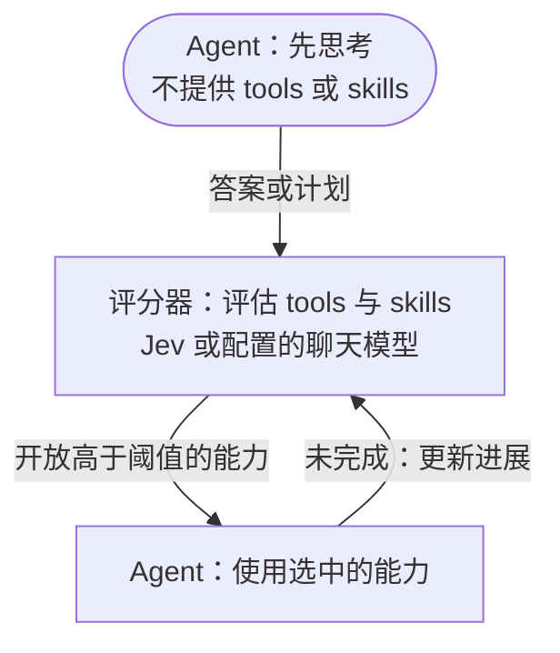

# Just enough tools

**先思考，需要时再给 tools 和 skills。**

[English](README.md) · [安装](#安装) · [参与贡献](CONTRIBUTING.md)

**目标：准确率不打折，Agent 费用近乎减半。**

Just enough tools 是一个 [DeepSeek Harness](https://github.com/deepseek-ai/deepseek-harness) 插件，用 [Jev](https://typesafe.ai/blog/introducing-system-one-models-and-jev) 逐轮选择 tools 和 skills，也支持可选的 OpenAI 兼容评分器。

Agent 往往会收到远超当前任务所需的能力，由此产生两类浪费：

- **额外输入成本**：无用 tool 和 skill 的 schema、描述在反复请求中持续消耗 token。
- **过度调用**：不必要的 tool 和 skill 调用增加执行步骤、等待时间和费用。

插件将 tools 和 skills 放进同一个候选池，只向 Agent 开放当前任务需要的能力。每个 Agent 独立维护已开放集合。

## 工作原理



每项能力独立评分，共用一个阈值。**高于阈值**的工具变为可调用，选中的 skill 加载完整指令。已开放能力保留，后续只评估剩余候选。执行 skill 所需的工具仍然独立评分。

简单问题可以首轮直接回答：Agent 以 `No external capabilities needed.` 开头并给出完整答案。只有候选发现完整且所有分数**严格低于阈值**时，才跳过第二次 Agent 调用。评分仍会执行；评分失败不会批准提前结束。

### 例子

对于“修复登录报错，并运行测试”，评分器可以先开放 `login-debug` skill 和 `grep`、`read`，再随任务推进补充 `edit`、`bash`。润色文字可能只需一个写作风格 skill，也可能完全不需要外部能力。

## 安装

需要 Node.js 22.19+、DeepSeek Harness **0.1.7-alpha.1** 和 Cordis **4.0.3**。

在仓库中构建：

```sh
npm ci
npm pack
```

安装插件并启动 dsh：

```sh
npx @deepseek-ai/dsh@0.1.7-alpha.1 plugin --profile web add /absolute/path/to/dsh-just-enough-tools-0.5.3.tgz
npx @deepseek-ai/dsh@0.1.7-alpha.1 web
```

1. 打开 **插件 → dsh-just-enough-tools**。
2. 选择提供商协议，配置密钥和模型，保存。
3. 新建对话，选择 **Just enough tools** 模式。

执行任务的模型仍由 dsh 配置。该模式自带文件、搜索和终端工具，并通过 dsh 发现允许模型调用的 skills。

## 提供商与设置

| 协议 | 默认 API 地址 | 模型 | 密钥环境变量 |
| --- | --- | --- | --- |
| System One / TypeSafe | `https://api.typesafe.ai/v1` | `jev-latest` | `TYPESAFE_API_KEY` |
| Vercel AI Gateway (Evaluation) | `https://ai-gateway.vercel.sh/v4/ai` | `typesafe-ai/jev` | `AI_GATEWAY_API_KEY` |
| OpenAI-compatible / LM Studio | `http://127.0.0.1:1234/v1` | 必填：提供商模型 ID | `OPENAI_API_KEY` |

支持兼容协议的自定义根地址或完整端点。密钥优先级为：页面保存值 → `JEV_API_KEY` → 对应提供商环境变量。使用环境变量前请重置旧的已保存密钥。本地聊天服务未启用鉴权时可留空。dsh 在启动时读取 `.env`，修改文件后需要重启。

System One 和 Vercel 返回原生决策概率。OpenAI 兼容评分需要能生成 JSON 分数的生成式模型，分数是模型估计值，并非经过校准的决策概率。仅有编码器的模型需要额外的决策服务。插件不会自动切换评分协议。

| 设置 | 默认值 |
| --- | --- |
| Tool / Skill 开放阈值 | `0.5` |
| 每轮对话最大步骤 | `12` |
| 路由操作超时 | `60000` 毫秒 |
| 终端评分日志 | 开启 |

提供商设置和日志开关即时生效；修改路由限制后请新建对话。日志在 dsh 启动终端显示逐项分数、阈值和开放结果。评分或注册失败会停止执行并明确报错。

## 添加 skill

创建 `.dsh/skills/login-debug/SKILL.md`，也可使用 dsh 配置的其他 skill 目录：

```markdown
---
name: login-debug
description: Diagnose login and session failures before changing authentication code.
---
Reproduce the failure, inspect the relevant code, make a focused fix, and run the affected tests.
```

评分器最初只接收摘要，选中后 Agent 才获得完整指令。能力选择管理可用性和指令注入，不改变文件系统权限。

## 参与贡献

欢迎改进能力选择、提供商支持、阈值策略和使用示例。参见[贡献指南](CONTRIBUTING.md)、[设计说明](DESIGN.md)和[接入说明](docs/integration.md)。

独立社区项目 · [MIT 协议](LICENSE)。
