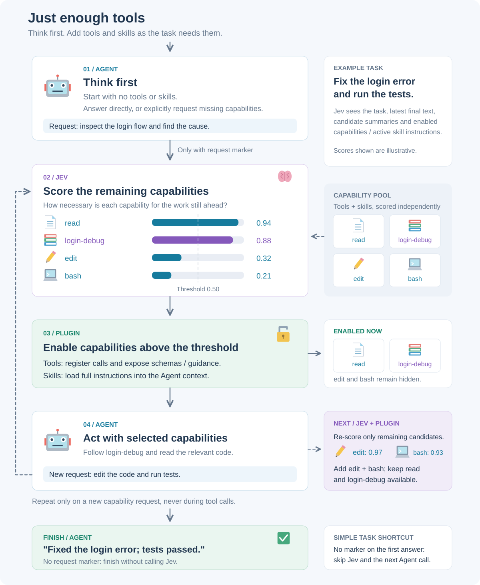

# Just enough tools

**先思考，需要时再给 tools 和 skills。**

[English](README.md) · [安装](#安装) · [参与贡献](CONTRIBUTING.md)

**目标：准确率不打折，Agent 费用近乎减半。**

Just enough tools 是一个 [DeepSeek Harness](https://github.com/deepseek-ai/deepseek-harness) 插件，用 [Jev](https://typesafe.ai/blog/introducing-system-one-models-and-jev) 逐轮选择 tools 和 skills，也支持可选的 OpenAI 兼容评分器。

Agent 往往会收到远超当前任务所需的能力，由此产生两类浪费：

- **额外输入成本**：无用 tool 和 skill 的 schema、描述在反复请求中持续消耗 token。
- **过度调用**：不必要的 tool 和 skill 调用增加执行步骤、等待时间和费用。

插件将 tools 和 skills 放进同一个候选池，只向 Agent 开放当前任务需要的能力。每个 Agent 独立维护已开放集合。

## 工作原理



图中分数仅用于说明逐轮选择过程，不是实测结果。[TikZ 源文件](docs/assets/how-it-works.tex)。

图中蓝色表示 tool，紫色表示 skill。Jev 接收用户任务、Agent 最新一轮的最终文字、剩余候选能力摘要、已开放能力集合，以及已启用 skill 的完整指令，不接收工具执行参数 schema。

Agent 一轮最终回复的任意位置包含 `REQUEST_CAPABILITIES` 或支持的拼写变体时，就调用评分器。提示词要求 Agent 说明缺少的操作能力或工作流程。`agent_response` 只包含该轮最终回复的纯文本，不包含工具调用、工具结果或隐藏思考。工具和 skill 共用阈值，**高于阈值**的能力被开放并持续保留。后续请求只评分剩余候选；skill 的工具依赖仍独立评分。

检测忽略大小写，兼容全角字符、空格、连字符和省略分隔符。不限制括号、位置或 Markdown 格式；单独关键词、引用和代码块中的关键词也会触发。

没有标记时直接结束，包括首轮：**不调用 Jev，也不增加 Agent 调用**。明确请求后，Agent 根据路由结果继续；如果没有能力通过阈值，则利用现有能力回答或说明限制，不重复申请相同能力。

### 例子

以“修复登录报错，并运行测试”为例，阈值设为 `0.50`：

| 阶段 | Agent 回复或操作 | Jev / 插件决策 |
| --- | --- | --- |
| 思考 | `[REQUEST_CAPABILITIES]` + 换行 + “需要先检查登录流程。” | 开放 `read` 0.94 和 `login-debug` 0.88；`edit` 0.32 和 `bash` 0.21 继续隐藏。 |
| 检查 | Agent 按 debug 工作流程阅读代码，最后请求：`[REQUEST_CAPABILITIES]` + 换行 + “已找到问题，需要修改代码并运行测试。” | 只评估剩余候选：新增 `edit` 0.97 和 `bash` 0.93。之前开放的能力继续保留。 |
| 完成 | Agent 修改代码、运行测试，回复：“已修复，测试通过。” | 无标记，不调用 Jev，结束本轮对话。 |

分数和结果为示例。润色文字可能只需一个写作风格 skill，也可能完全不需要外部能力。

## 安装

需要 Node.js 22.19+、DeepSeek Harness **0.1.7-alpha.1** 和 Cordis **4.0.3**。

在仓库中构建：

```sh
npm ci
npm pack
```

安装插件并启动 dsh：

```sh
npx @deepseek-ai/dsh@0.1.7-alpha.1 plugin --profile web add /absolute/path/to/dsh-just-enough-tools-0.5.8.tgz
npx @deepseek-ai/dsh@0.1.7-alpha.1 web
```

1. 打开 **插件 → dsh-just-enough-tools**。
2. 选择提供商协议，配置密钥和模型，保存。
3. 新建对话，选择 **Just enough tools** 模式。

执行任务的模型仍由 dsh 配置。该模式自带文件、搜索和终端工具，并通过 dsh 发现允许模型调用的 skills。

## 提供商与设置

| 协议 | 默认 API 地址 | 模型 | 密钥环境变量 |
| --- | --- | --- | --- |
| System One / TypeSafe | `https://api.typesafe.ai/v1` | `jev-latest` | `TYPESAFE_API_KEY` |
| Vercel AI Gateway (Evaluation) | `https://ai-gateway.vercel.sh/v4/ai` | `typesafe-ai/jev` | `AI_GATEWAY_API_KEY` |
| OpenAI-compatible / LM Studio | `http://127.0.0.1:1234/v1` | 必填：提供商模型 ID | `OPENAI_API_KEY` |

支持兼容协议的自定义根地址或完整端点。密钥优先级为：页面保存值 → `JEV_API_KEY` → 对应提供商环境变量。使用环境变量前请重置旧的已保存密钥。本地聊天服务未启用鉴权时可留空。dsh 在启动时读取 `.env`，修改文件后需要重启。

System One 和 Vercel 返回原生决策概率。OpenAI 兼容评分需要能生成 JSON 分数的生成式模型，分数是模型估计值，并非经过校准的决策概率。仅有编码器的模型需要额外的决策服务。插件不会自动切换评分协议。

| 设置 | 默认值 |
| --- | --- |
| Tool / Skill 开放阈值 | `0.5` |
| 每轮对话最大步骤 | `12` |
| 路由操作超时 | `60000` 毫秒 |
| 终端评分日志 | 开启 |

提供商设置和日志开关即时生效；修改路由限制后请新建对话。日志在 dsh 启动终端显示逐项分数、阈值和开放结果。评分或注册失败会停止执行并明确报错。

## 添加 skill

创建 `.dsh/skills/login-debug/SKILL.md`，也可使用 dsh 配置的其他 skill 目录：

```markdown
---
name: login-debug
description: Diagnose login and session failures before changing authentication code.
---
Reproduce the failure, inspect the relevant code, make a focused fix, and run the affected tests.
```

评分器最初只接收摘要，选中后 Agent 才获得完整指令。能力选择管理可用性和指令注入，不改变文件系统权限。

## 参与贡献

欢迎改进能力选择、提供商支持、阈值策略和使用示例。参见[贡献指南](CONTRIBUTING.md)、[设计说明](DESIGN.md)和[接入说明](docs/integration.md)。

独立社区项目 · [MIT 协议](LICENSE)。
